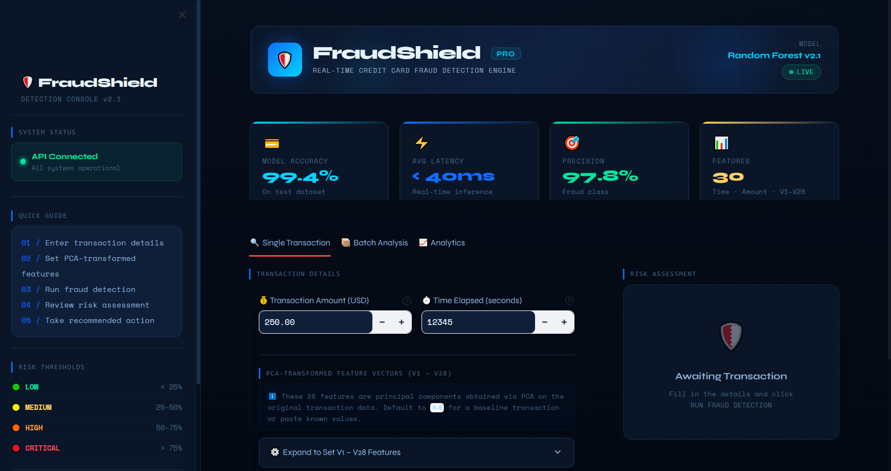
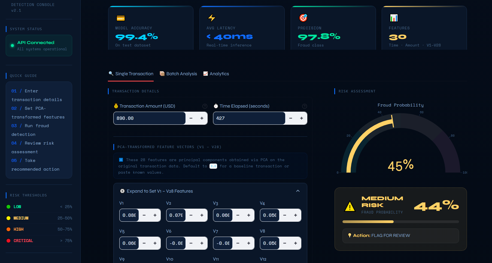
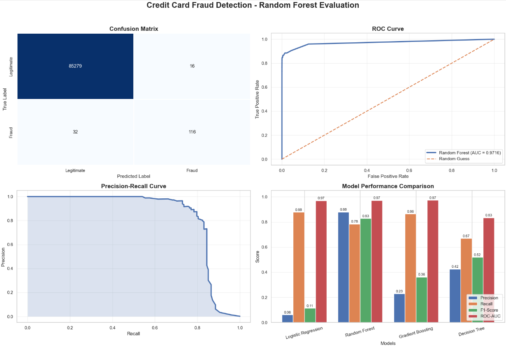

# Credit Card Fraud Detection System

<div align="center">

[](https://ajilatosin-credit-card-fraud-detection.hf.space)
[](https://www.python.org/)
[](https://fastapi.tiangolo.com/)
[](https://streamlit.io/)
[](LICENSE)

### End-to-End Machine Learning Fraud Detection Application

Detect fraudulent credit card transactions in real time using a production-ready machine learning system powered by Random Forest, FastAPI, and Streamlit..

[Live Demo](https://ajilatosin-credit-card-fraud-detection.hf.space)

</div>

---

# Project Overview

This project is a full-stack Credit Card Fraud Detection System designed to identify suspicious financial transactions in real time using machine learning.

The application combines:

- FastAPI backend for serving machine learning predictions through REST APIs
- Streamlit frontend for interactive analytics and fraud prediction
- Random Forest machine learning model trained on highly imbalanced transaction data
- Docker-based deployment architecture
- Hosting on Hugging Face Spaces

The model was trained on the Kaggle Credit Card Fraud Detection dataset and optimized to minimize false positives while maintaining strong fraud detection performance.

---

# Application Screenshots

## Streamlit Dashboard - Overview

  

## Streamlit Dashboard - Prediction Page

  

## Model Visualization & Analytics

  

---

# Features

## Real-Time Fraud Prediction

Users can manually enter transaction details and receive:

- Fraud probability score
- Risk classification
- Prediction confidence
- Automated recommendation

---

## Batch Transaction Analysis

Upload CSV files containing multiple transactions and receive:

- Bulk fraud predictions
- Downloadable prediction results
- Fraud summary statistics
- Risk distribution analysis

---

## Interactive Analytics Dashboard

The dashboard includes:

- Fraud vs Non-Fraud distribution analysis
- Feature importance visualization
- Prediction confidence charts
- Model performance metrics

---

## Fault-Tolerant Prediction System

If trained model files fail to load due to corruption or deployment issues, the application automatically switches to a fallback prediction engine to ensure uninterrupted functionality.

---

# Machine Learning Model

## Model Used

- Random Forest Classifier
- Built with scikit-learn

## Dataset

- Kaggle Credit Card Fraud Detection Dataset
- Highly imbalanced transactional dataset
- PCA-transformed confidential banking features

Dataset Features:

| Feature Type | Description |
|---|---|
| `V1 - V28` | PCA-transformed confidential features |
| `Time` | Time elapsed between transactions |
| `Amount` | Transaction amount |

---

# Model Performance

| Metric | Score |
|---|---|
| Accuracy | 99.95% |
| Precision | 89.23% |
| Recall | 78.4% |
| F1-Score | 83.45% |
| ROC-AUC | 0.972 |

## Optimization Techniques

- Class imbalance handling
- Feature scaling
- Threshold optimization
- Random Forest ensemble learning

---

# Technology Stack

| Layer | Technologies |
|---|---|
| Machine Learning | Python, Scikit-learn, Pandas, NumPy |
| Backend API | FastAPI, Uvicorn, Joblib |
| Frontend UI | Streamlit, Plotly |
| Deployment | Docker, Hugging Face Spaces |
| Version Control | Git, GitHub |

---

# Project Structure

```bash
credit-card-fraud-detection/
│
├── app.py
├── streamlit_app.py
├── requirements.txt
├── Dockerfile
├── start.sh
│
├── models/
│   ├── random_forest_fraud_model.pkl
│   ├── scaler_fraud_model.pkl
│   ├── feature_columns_fraud_model.pkl
│   └── optimal_threshold_fraud_model.pkl
│
└── README.md
```

---

# Local Installation

## 1. Clone the Repository

```bash
git clone https://github.com/your-username/credit-card-fraud-detection.git

cd credit-card-fraud-detection
```

---

## 2. Create Virtual Environment

### Windows

```bash
python -m venv venv

venv\Scripts\activate
```

### Linux / macOS

```bash
python3 -m venv venv

source venv/bin/activate
```

---

## 3. Install Dependencies

```bash
pip install -r requirements.txt
```

---

## 4. Add Trained Model Files

Due to GitHub file size limitations, model files are not included in the repository.

Place these files inside the `models/` directory:

```bash
random_forest_fraud_model.pkl
scaler_fraud_model.pkl
feature_columns_fraud_model.pkl
optimal_threshold_fraud_model.pkl
```

---

# Running the Application

## Start FastAPI Backend

```bash
uvicorn app:app --reload --port 8000
```

---

## Start Streamlit Frontend

```bash
streamlit run streamlit_app.py
```

---

## Open in Browser

Frontend:

```bash
http://localhost:8501
```

Backend API Documentation:

```bash
http://localhost:8000/docs
```

---

# Docker Deployment

This project supports Docker deployment for production and Hugging Face Spaces hosting.

## Build Docker Image

```bash
docker build -t fraud-detection .
```

## Run Docker Container

```bash
docker run -p 8501:8501 -p 8000:8000 fraud-detection
```

---

# Live Deployment

## Hugging Face Space

Live Application:

https://ajilatosin-credit-card-fraud-detection.hf.space

---

# API Endpoints

| Endpoint | Method | Description |
|---|---|---|
| `/health` | GET | Health check and model status |
| `/predict` | POST | Predict a single transaction |
| `/predict/batch` | POST | Batch prediction endpoint |
| `/debug` | GET | Debug and model loading information |

---

# Example Prediction Request

## POST `/predict`

```json
{
  "Time": 0,
  "Amount": 149.62,
  "V1": -1.359807,
  "V2": -0.072781,
  "V3": 2.536347,
  "V4": 1.378155,
  "V28": -0.021053
}
```

---

# Future Improvements

- Deep learning fraud detection models
- Real-time streaming predictions
- User authentication system
- Database integration
- Model monitoring dashboard
- CI/CD automation

---

# Contributing

Contributions are welcome.

To contribute:

1. Fork the repository
2. Create a feature branch
3. Commit your changes
4. Open a pull request

---

# License

This project is licensed under the MIT License.

---

# Acknowledgements

- Kaggle — Credit Card Fraud Detection Dataset
- FastAPI
- Streamlit
- Hugging Face Spaces
- Scikit-learn

---

# Author

## Ajilatosin

Machine Learning Engineer and Data Scientist

If you found this project useful, consider giving the repository a star on GitHub.
